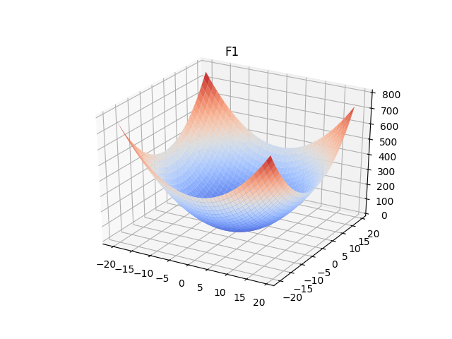
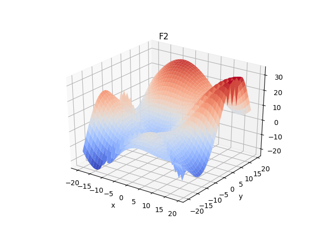
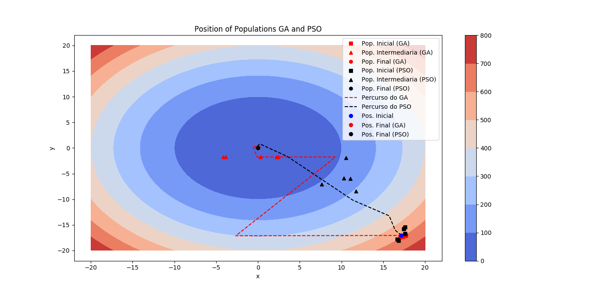
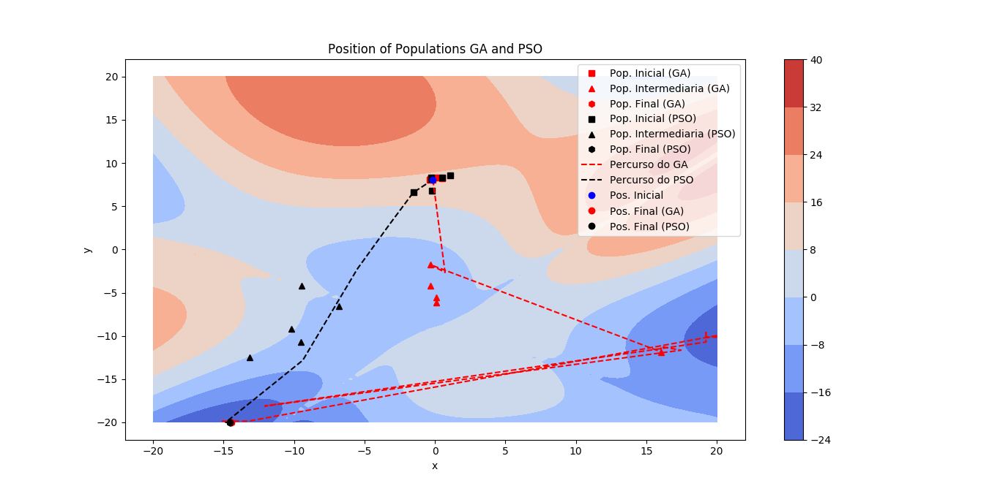

# Comparação entre os Algoritmos PSO e GA

- Trabalho desenvolvido na disciplina de Inteligência Computacional do Mestrado em Engenharia Elétrica - IFPB.

- Consiste em uma simulação do funcionamento do algoritmo PSO e o algoritmo genético (GA) que visa comparar o desempenho deles. Ambos os algoritmos foram desenvolvidos na linguagem de programação Python, versão 2.7.

## Funções de custo

## Resultados

### Função de custo F1

### Função de custo F2

