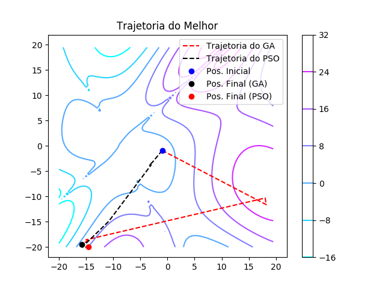

# GA

- F12: [1.05203412 1.87166318] -0.523109398479
- F15: [-18.48446312 -19.98479245] -1260.42883474
- F16: [-14.37141154 -19.67573343] -22.9311457424

# PSO

- F12: [0.44210132258315954, 2.1010573374976027] -0.523109398476
- F15: [-18.480911063511183, -20.0] -1263.28677087
- F16: [-14.583501035637987, -20.0] -23.8062051354

